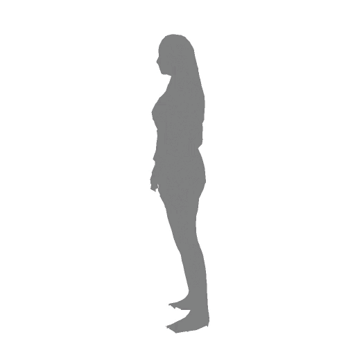
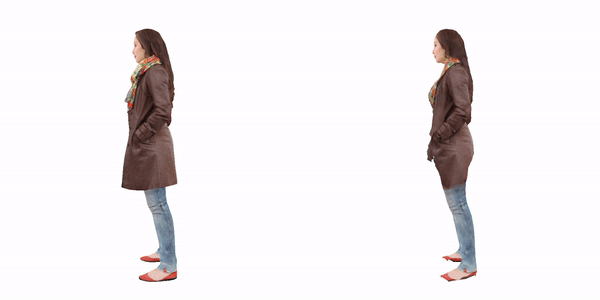

# BodyFitting - A Multi-view SMPL Optimization Framework

Bodyfitting is the SMPL fitting tool in "Generalizable Neural Performer: Learning Robust Radiance Fields for Human Novel View Synthesis" and GeneBody Dataset. 

This toolbox can register SMPL from calibrated motion capture images, as well as the synthetic meshes; SMPL+D and texture fitting is also provided.

## Setup environment
The project is built on python3.6 and torch 1.2, you can set up the environment as:
``` bash
conda env create -n bodyfitting python=3.6
pip install -r requirements.txt
cd thirdparty/neural_renderer && python setup.py install
cd thirdparty/mesh_grid && python setup.py install
```
Note: *neural_renderer* in this repo is a modified version for texture fitting. *mesh_grid* is our implemetation of mesh closest point.

## Data Download
Please download the [SMPL](https://smpl-x.is.tue.mpg.de/)/[SMPLx](https://smpl.is.tue.mpg.de/) model, and HMR model from [here](https://hkustconnect-my.sharepoint.com/:u:/g/personal/wchengad_connect_ust_hk/EXuFgaiOuMRMh8O_oNzc3DYBlSyxsVOPWNA-Qn3m4PV-zA?e=Aie8nd), and put them in the *data* folder.

## 2D keypoint detector
We require Openpose for 2D keypoint detection, please build the cpp version from the [instructions](https://github.com/CMU-Perceptual-Computing-Lab/openpose/blob/master/doc/installation/0_index.md#compiling-and-running-openpose-from-source).

Other alts such as [MMPose](https://github.com/open-mmlab/mmpose) also fits this framework, as long as appropriate joint mapping is assigned.

## Demos

### Organize your data
## Datasets
Take fitt GeneBody and RenderPeople as an example, first you should organize your data directory as follows
```
├──genebody/
  ├──amanda/
  ├──barry/
  ├──...
├──rp_scans/
  ├──rp_alexandra_posed_013_OBJ/
  ├──rp_alisha_posed_001_OBJ/
  ├──rp_alvin_posed_006_OBJ/
  ├──...
```


### Motion capture data fitting
You can fit your motion capture data using the following command, choose `smpl_type` and `use_mask` to enable silhouette fitting if human segmentation is given.
For example to fit `amanda` sequnece
```bash
python apps/genebody_fitting.py --target_dir path_to_genebody --subject amanda --openpose_dir path_to_openpose --output_dir path_to_output --smpl_type smplx --use_mask --tasks openpose smplify output
```
You can find the SMPL/SMPLx obj file and optimized parameters in path_to_output.

### Mesh data fitting 
You can fit your Render People mesh data using the following command. To perform SMPL+D and texture fitting, please add `smpld` and `texfit` in tasks list.
```bash
python apps/rp_fitting.py --target_dir path_to_rp_scans --openpose_dir path_to_openpose --output_dir path_to_output --smpl_type smplx --smpl_uv_dir ./smpl_uv --tasks openpose smplify smpld texfit output 
```

### Texture fitting
Texture fitting takes opitmized SMPL+D as input, and optimize the texture image by the L2 loss between rendered images of groudtruth mesh and SMPL+D mesh. The process and results are as follows:


<p align="center"> </p>
<p align="center">Left: Texture optimization process, Right: Comparison of ground truth mesh and textured SMPL+D</p>


## Citation
If you find this repo useful for your work, please cite the follow technical paper
```
@article{cheng2022generalizable,
    title={Generalizable Neural Performer: Learning Robust Radiance Fields for Human Novel View Synthesis},
    author={Cheng, Wei and Xu, Su and Piao, Jingtan and Qian, Chen and Wu, Wayne and Lin, Kwan-Yee and Li, Hongsheng},
    journal={arXiv preprint arXiv:2204.11798},
    year={2022}
}

@inproceedings{SMPL-X:2019,
  title = {Expressive Body Capture: {3D} Hands, Face, and Body from a single Image},
  author = {Pavlakos, Georgios and Choutas, Vasileios and Ghorbani, Nima and Bolkart, Timo and Osman, Ahmed A. A. and Tzionas, Dimitrios and Black, Michael J.},
  booktitle = {Proceedings IEEE Conf. on Computer Vision and Pattern Recognition (CVPR)},
  pages     = {10975--10985},
  year = {2019}
}
```